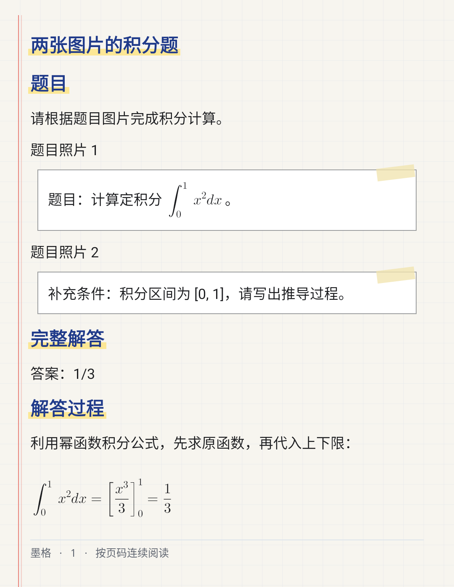

# 墨格 Moge

[](https://github.com/fxx255/moge/actions/workflows/android-checks.yml)
[](LICENSE)

墨格是一款使用 Kotlin 和 Jetpack Compose 开发的 Android AI 学习助手。以新对话为入口，支持文字、拍照和相册提问，将解答、公式和图表放在同一张「稿纸」上。

An open-source Android AI study assistant with photo questions, conversation history, math rendering and customizable notebooks. Bring your own model endpoint and API key.

当前正式版本：**0.3.1**（`versionCode = 11`）。从 [GitHub Releases](https://github.com/fxx255/moge/releases/latest) 下载 arm64 安装包。

## 功能

- **新对话与多轮提问**：文字、拍照、相册共用浮动输入栏；输入公式有排版预览，发送后的题目卡渲染 LaTeX；历史支持搜索、分组、重命名、置顶、收藏和删除；左右滑动切换新对话、历史与题册，返回对话保留阅读位置。
- **拍照解题**：自由裁剪、多图输入、横屏拍摄与方向旋转动画；裁剪期间暂停相机预览，水平参考线随屏幕方向校正；提供标准解答和帮我查错。
- **稿纸式解答**：Markdown、LaTeX 公式、表格、函数图和结构化框图；兼容公式内的中文标签和概率条件符号，无法排版时完整显示公式源码；可在设置中开启「答案优先」，沿稿纸折痕展开完整讲解。
- **自定义题册**：用户自行建立分类，主动收藏题目和解答；历史和题册共用分类但独立保存归属。长按选择后可保持原卡片拖动；拖到上方筛选行展开全部分组，向下拖入弧形红色垃圾桶区域删除。分类管理使用卡片、改名笔和拖动柄，支持拖动排序。历史收藏可直接打开对应题册条目。
- **长图分享**：稿纸风格预览、保存和系统分享题目与解答；极长内容按顺序分图。
- **模型配置**：自行填写兼容接口地址、模型名称和 API Key，按服务能力选择图片输入、搜索协议和推理强度。
- **应用内更新**：正式版启用版本检查、下载校验和系统安装，默认使用 `https://ghfast.top/` 镜像，失败时回退 GitHub 直连。

图表由结构化数据在本地绘制，当前没有接入通用文生图服务。图片理解、搜索等能力取决于所选模型和服务端接口。

## 使用

1. 从源码构建并安装应用。
2. 在设置中添加模型配置，填写接口地址、模型名称和自己的 API Key。
3. 文字提问可使用普通聊天模型；拍照、相册提问需要服务端支持图片输入。
4. 根据服务端实际支持的协议设置搜索；不支持时关闭搜索。

仓库不包含模型服务或共享 API Key。模型请求直接发送到用户配置的服务端，题目文字、照片与必要的历史上下文会随请求发送，费用和数据处理由对应服务决定。API Key 使用 Android Keystore 加密保存在设备上；对话、收藏和附件保存在本地，数据库和部分偏好可能受 Android 系统备份设置影响。应用内没有录音输入。

## 构建

建议使用 Android Studio，也可以使用仓库自带的 Gradle Wrapper。

- **JDK 21**，不要使用 JDK 25。
- Android SDK Platform **36**、Build Tools **36.0.0** 和 Platform Tools。
- Gradle **8.14.3**，由 Wrapper 自动下载；依赖版本集中在 `gradle/libs.versions.toml`。
- 最低 Android **8.0 / API 26**；release 为 **arm64-v8a**，debug 另支持 **x86_64** 模拟器。
- Windows 建议将工程放在不含中文等非 ASCII 字符的路径中。

克隆源码：

```sh
git clone https://github.com/fxx255/moge.git
cd moge
```

将 Android SDK 配置到 `ANDROID_HOME` 或本地 `local.properties` 的 `sdk.dir`。`local.properties` 不提交到 Git。安装所需 SDK：

```sh
sdkmanager "platforms;android-36" "build-tools;36.0.0" "platform-tools"
```

Linux / macOS：

```sh
chmod +x gradlew
./gradlew assembleDebug
```

Windows PowerShell（先将 `JAVA_HOME` 指向 JDK 21）：

```powershell
.\gradlew.bat assembleDebug
```

debug APK 输出到 `app/build/outputs/apk/debug/app-debug.apk`，包名为 `com.moge.app.debug`。开发 release 可用 `assembleRelease` 构建，输出到 `app/build/outputs/apk/release/app-release.apk`，包名为 `com.moge.app`。

**签名文件不入仓库。** 新克隆使用 Android Gradle Plugin 默认生成的调试密钥；已有本地 `app/debug.keystore` 时使用该文件，以保留开发安装的签名身份。调试签名和开发 release 的应用内更新关闭；不同开发者的调试签名可能不同。

## 验证与自动检查

```sh
python3 -m unittest discover -s scripts/release -p 'test_*.py'
./gradlew --no-configuration-cache testDebugUnitTest lintDebug assembleDebug
```

Windows 使用 `python` 和 `.\gradlew.bat` 执行对应命令。分支推送和 Pull Request 会运行 [Android checks](https://github.com/fxx255/moge/actions/workflows/android-checks.yml)，检查发布脚本、单元测试、Lint 和 debug 构建，无需签名 Secrets。

0.2.7 的本地完整验证通过 **972 项 Android 单元测试**。0.3.1 新增图片内存处理、拖动缩放、中断续写、唤醒锁和更新镜像的定向检查；发布脚本有 **13 项测试**。正式发布流程执行完整测试、Lint 与签名构建，实际结果以 Actions 为准。

公式与拖动改进详见 [修改方案](docs/math-drag-revision-plan.md) 和 [完成报告](docs/math-drag-fix-report.md)。

0.2.5 修复回答首次测量使用空文本高度的问题，覆盖完成回答与流式正文，详见 [滚动显示修复报告](docs/answer-scroll-fix-report.md)。

0.2.6 的收藏互通、历史卡片、拖动、滑动导航与相机调整详见 [修改报告](docs/notebook-navigation-revision-report.md)。

0.2.7 的公式兜底、滑动专用动画、阅读位置恢复、浮动输入栏和分类卡片详见 [修改报告](docs/formula-navigation-ui-revision-report.md)。

0.3.1 的图片兼容、拖动缩放、后台生成、接续回答及镜像更新详见 [版本说明](docs/releases/0.3.1.md)。首个正式版采用新的专用签名，同包名开发版无法被它直接覆盖；卸载前请保存需要的内容，卸载会清除应用数据。

## 稿纸分享示例

以下示例由原生导出器使用测试题目生成。交互与修复记录见 [0.2.3 修改报告](docs/interaction-share-fix-report.md)。



## 项目结构

- `app/src/main/java/com/moge/app/data`：本地数据库、模型接口、回复解析和更新。
- `app/src/main/java/com/moge/app/runtime`：生成任务、历史上下文与图像管理。
- `app/src/main/java/com/moge/app/ui`：Compose 页面、相机、公式与图表渲染、长图导出。
- `app/src/test`：单元与集成测试。
- `scripts/release`：APK 校验、更新元数据和 GitHub Release 发布工具。
- `.github/workflows`：自动检查与正式标签发布。
- `docs`：实施记录、修改报告和发布说明；历史报告中的版本及路径按其当时环境记录。

发布和应用内自动更新的配置见 [GitHub 分发与应用更新](docs/github-release.md)。正式发布必须使用专用长期签名，并配置 `github-release` 环境中的 Secrets；现有开发 APK 不作为正式更新包发布。

## 反馈与贡献

欢迎提交 Issue 和 Pull Request。反馈问题时请说明应用版本、Android 版本、复现步骤，以及所用模型和接口协议；日志和截图请先去掉 API Key、个人题目和其他敏感内容。代码修改请运行与改动相关的测试和 Lint。

## 许可证

墨格自身源码按 [MIT License](LICENSE) 开源。第三方库、字体和工具保持各自许可证，参见 [第三方说明](THIRD_PARTY_NOTICES.md)。
