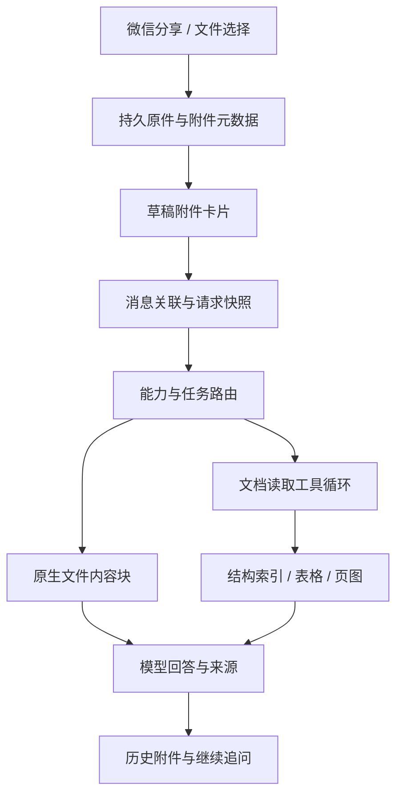

# 文档附件分析与 Anthropic 接入修订方案

日期：2026-10-04。调查基线：0.3.4，versionCode 14。

本方案回应两项反馈：Anthropic 联网接入实际不可用；PDF、Word 等文件导入后变成输入框里的文字。当前仅编写方案，不修改应用实现、不撤销功能、不发布版本。

## 1. 推荐结果与用户体验

推荐建立“持久文档附件 + 原生文件接口 + 文档读取工具”的统一能力。

用户从微信分享《讲义.pdf》进入新对话，或在对话中选择《实验报告.docx》后，输入区域显示文件卡片：原文件名、格式、大小，以及可用时的页数。输入框只保留用户自己写的“解释第 12 页的图”“检查第三章的推导”等问题。发送后，原件继续附在那条消息上；退出应用、重新进入、追问和重试都能继续引用同一文件。

文件卡片可打开原件或预览。PDF 预览支持跳页，DOCX 初期提供章节、段落、表格与图片的结构预览，PPTX 提供幻灯片索引与内容预览。结构预览与原始排版预览应有清楚的区别；未接入 Office 排版引擎时，不声称已经完整还原 Word/PPT 页面。

模型选择具体读取方式：服务支持原生 PDF 时直接传文档；需要检查局部内容或服务不支持文件时，通过工具读取指定章节、页、表格和图片。回答附上可定位的文件来源，例如“讲义.pdf，第 12 页”“实验报告.docx，第三章，表格 2”。点击来源返回附件对应位置。

“原生读取”仍需要服务商的文档处理或应用的解析、渲染工具。关键是保留原件和结构、允许持续访问图文内容，不能只把一段全文转译藏到请求里就当作完成此功能。

## 2. 现状核查

### 文档导入的确定问题

- `SolveViewModel.importDocuments()` 调用 `CaptureStore.extractDocument()`，把结果拼接为 `【文件：…】` 写入 `input`，并在 `finally` 中删除原文件。因此附件无法持续存在，也无法再次读取尚未转译的内容。
- `DocumentTextExtractor` 对 DOCX/PPTX 使用正则去除 XML 标签，对 PDF 使用二进制字符串与 `BT…ET` 正则，对旧版 Office 只抽取 ASCII 可打印字符。这些路径不能可靠保留中文 PDF 编码、表格、阅读顺序、图片和章节关系。
- 文本结果直接截断为 120,000 字符。PDF 图片后备路径最多渲染前 9 页，并占用普通照片的数量限制。当前系统不能保证读取后面页面。
- 导入时复制原件到私有目录的方向是正确的，但没有持久化原文件名、MIME、哈希和附件身份。
- `GenerationManager.Submission`、`GenerationPreparer`、`ChatMessage`、`RequestSnapshot` 和草稿存储以文本及图片为主，尚无完整文档引用和文档工具执行记录。

### Anthropic 的已知缺陷与未知事项

- `AiSearchProtocol.ANTHROPIC` 同时控制 Messages 传输和联网模式；协议选择与搜索开关混用。原生 Anthropic 与“Claude 模型的 OpenAI 兼容网关”必须分别处理。
- `readAnthropicStreaming()` 在遇到 `pause_turn` 时抛出网络错误。官方协议要求将暂停的 assistant 内容完整带回下一次请求继续执行，这是确定的实现缺口。
- 同一位置也把 `tool_use` 当网络错误，目前没有本地工具执行与 `tool_result` 续轮机制。服务端工具与本地工具的流程不同，不能混为一类。
- 强制联网直接发送指定工具的 `tool_choice`，没有考虑模型或设置对强制工具调用的限制；该参数需要能力校验。
- 这些问题可能导致失败，但没有用户此次请求的脱敏错误、端点类型和模型信息，不能认定具体失败原因。
- 上次的验证是模拟 HTTP/SSE 回归测试，未完成真实端点验收。模拟测试通过不能证明用户的 Anthropic 服务实际可用。

## 3. Anthropic：先诊断，明确修复与撤回条件

### 3.1 配置拆分

新增独立的 API 协议：OpenAI Chat Completions、OpenAI Responses、Anthropic Messages。联网作为另一项配置，保存关闭、自动、服务商原生搜索等选择及验证结果。

API 协议在关闭联网时也保持不变。不能因为搜索关闭就把 Anthropic 请求切回 OpenAI，也不能仅因模型名含 Claude 就切换认证头和地址。

增加按“端点 + 档案 + 模型 + 凭据修订号”管理的能力记录：图片、原生 PDF、Office 文件输入、Files API、本地工具调用、服务端联网、强制工具选择。能力使用未知、已验证支持、明确不支持三种状态；未经验证的兼容服务不默认继承官方服务的所有功能。

### 3.2 诊断与协议修复

设置页分开验证普通文本、流式响应、联网搜索，分别显示结果。先确认基础 Messages 能工作，再验证搜索权限、工具版本和来源信息。记录脱敏的 HTTP 状态、服务端错误类型、请求 ID、所选协议、模型和实际 URL 路径；诊断不包含密钥、文件内容或完整请求体，也不要求用户发送密钥。

修复内容包括：

1. 统一根地址、`/v1`、`/v1/messages` 的组装，按所选协议使用正确认证，验证代理网关的实际接口要求。
2. 保留完整结构化 assistant 内容，包括工具块、签名及未知但需原样续传的块。`pause_turn` 继续原请求；不能只保留最终文本或添加一句普通“继续”。
3. 服务端 `server_tool_use` 由服务商执行；本地 `tool_use` 才分发到注册工具，并按 ID 返回 `tool_result`。未知工具给出明确工具错误。
4. 根据已验证能力选择搜索工具版本和 `tool_choice`。不能强制调用时使用允许的模式并核对实际搜索结果；用户要求必须联网而未搜索时明确报告失败。
5. 对真实搜索记录、来源引用、权限错误和工具错误分别处理。一般鉴权或网络失败不自动换协议重发。
6. 工具循环设置轮次、时间和数据预算，支持取消；按实际 HTTP 调用累计 usage，防止正文重复、重复落库及无界续轮。

### 3.3 验收与撤回

保留入口的条件是：目标真实端点完成普通流式对话和联网搜索验收，能够返回可核验的来源，且联网开关不会破坏基本对话。没有真实服务凭据可用于验收时，应标记“未验证”，不能再次以模拟测试替代真实可用性结论。

如果目标服务实际上只提供 OpenAI 兼容接口，按其协议配置，不能承诺原生 Anthropic 搜索能使用。如果 Messages 修复后仍无法通过验收，建议撤回这次新增的 Anthropic 入口。

撤回时保留已有密钥和档案数据，旧配置可读取并显示需重新选择协议，不能悄悄将其改成另一种认证方式。已经使用正常 OpenAI 接口的模型不受影响。旧快照仍能解码；需要撤回的请求给出具体原因并允许重新发送。

## 4. 文档能力如何落地

### 4.1 持久附件与内部文档模型

新增 `DocumentRepository` 管理原件，导入返回附件 ID，避免在导航、草稿和请求中到处传绝对路径。原件不可在解析结束时删除。

`DocumentAttachment` 保存 ID、原文件名、MIME、大小、SHA-256、私有路径、导入时间、页数或章节数、解析状态及版本。`DocumentBlock` 保存章节、段落、表格、图片等单元及其来源定位。派生图片和索引按原件哈希及解析版本缓存，可重新生成。

增加消息附件关联；草稿和请求快照均保存附件 ID。文本和照片继续使用原路径，新文档不再冒充图片附件。DOCX 没有稳定物理页码时使用章节与段落定位；完成排版转换后才建立页码映射。

导入先复制到临时文件，成功后原子登记原件与元数据。失败文件和未完成状态能够清理；已登记原件由引用管理回收。多文档保持用户选择顺序，所有解析结果都保留对应文件身份。

### 4.2 原生文件接口路线

按已验证服务能力发送文件内容块，用户文本独立为文本块。小文件可以使用服务支持的内嵌文件数据，支持 Files API 的服务可上传后复用 `file_id`；上传发生在发送分析请求时。

- **Anthropic Messages**：PDF 使用 `document` 块，原生处理文本与页面视觉内容，并支持文档引用。DOCX/PPTX 不能直接冒充 PDF/document 块；需要文档工具或经过转换的 PDF。
- **OpenAI Responses**：使用 `input_file`；官方当前支持 PDF、Word、PPT 等文件，但非 PDF 文档输入只提取文本，不把内嵌图片和图表自动放入模型上下文。图文分析必须补充图片/页面或转换成 PDF。
- **OpenAI Chat Completions**：官方文档规定文件块支持 PDF；不能假设兼容网关也实现该能力，更不能把 DOCX/PPTX 原件硬塞进去。

文件可上传不代表当前模型、网关或上下文窗口能分析它。路由需同时核对大小、文件类型、视觉能力和上下文限制。超限改用按需读取，不静默截断。

远端文件引用绑定服务端点、档案和凭据修订号，不能跨不同服务复用。记录到期时间，失效时从本机原件重建。管理应用自己上传的文件清理；删除派生缓存不能影响原件。首次实现可以先完成内嵌 PDF 路线，Files API 复用另行验收。

### 4.3 Android 本地工具路线

不增加必需后端作为第一阶段前提。现有最低系统为 Android API 26；桌面技能中的 Python、LibreOffice 和 Poppler 不能直接作为 APK 内功能使用，需要替换为可在 Android 运行的实现。

**PDF**：复用 `PdfRenderer` 做按页预览、按需渲染，解除固定前 9 页的逻辑限制。文本层解析先评估 PdfBox-Android 等候选库，对中文字体、压缩流、读取顺序和内存做验证；它不能替代扫描件 OCR 和完整表格识别。扫描页通过视觉模型读取，OCR 用于检索，中文 OCR 选型单独验证。表格结构不可靠时保留页图并交给视觉模型，不能把杂乱字符串视为完整表格。

**DOCX**：用 OOXML 结构解析读取段落、标题层级、列表、表格、合并单元格、图片关系、脚注与数学内容。按照文档顺序建立块索引，图片与所属章节一起提供。公式无法可靠解析时明确标记并提供可用的视觉路径，不能丢弃后宣称已完整读取。初期实现结构阅读，不承诺字体、浮动对象和分页的精确排版还原。

**PPTX**：按 `presentation.xml` 中的关系确定幻灯片顺序，不能按 ZIP 枚举顺序处理。读取标题、文本框、表格、图表数据、图片、备注及位置关系。初期提供内容级预览和图片读取；完整幻灯片画面需排版引擎生成，不能用抽取文本假装还原画面。

**旧版 DOC/PPT**：停止 ASCII 猜测。原生服务支持且验证通过时可以送原件；其他情况保留附件并显示需转换。稳定覆盖旧版 Office 和高保真 Word/PPT 视觉分析时，增加明确配置的转换服务，采用 LibreOffice 转 PDF，可结合 Docling 进行结构化处理。该服务是后续增强，不在本次方案中默认部署或自动上传。

XLSX 如继续保留入口，也应读取工作表、行列、单元格、缓存值和公式，不能继续仅提取 `sharedStrings.xml`；完整表格计算能力另设验收，避免扩散首期范围。

### 4.4 文档读取工具与技能

注册一组有边界的文档工具，模型通过标准工具调用按需访问当前对话授权的附件：

- `inspect_document(document_id)`：类型、页数、目录、可用阅读方式。
- `search_document(document_id, query)`：检索块，返回页/章节、片段与稳定块 ID。
- `read_document(document_id, locator)`：读取指定 PDF 页范围、Word 章节或幻灯片；明确返回实际覆盖范围。
- `read_table(document_id, table_id)`：表格行列与来源；超限显式分页。
- `view_document_image(document_id, locator)`：指定页图或内嵌图片及定位，交给有视觉能力的模型。

第一阶段优先本地结构索引、章节定位与关键词检索，不强制新建向量服务。中文检索要评估分词或字符级索引，不能把 SQLite 默认英文分词行为直接当作中文检索可用。

为 PDF、Word、PPT 分别提供精简的文档技能说明：先检查目录与范围；表格问题调用表格工具；扫描页和图表调用视觉路径；回答引用来源。技能负责指导阅读步骤，解析器与渲染器负责执行。仅添加 `SKILL.md` 或在提示词中写“可以读取文件”不会产生实际能力。

工具返回内容进入内部模型上下文和执行记录，不写入用户输入框或伪装成用户消息。仅允许访问当前会话的附件 ID，文档正文按资料处理，不能替代用户指令。首期工具均为固定的读取操作，不引入手机端任意 shell/Python 执行环境。

### 4.5 长文与持续追问

长文先建立目录和覆盖索引，再按问题读取具体位置。局部问答使用定位与检索；全文摘要需要遍历所有分段并合并结果，不能只检索几个命中段落后称作全文摘要。针对扫描长文，索引与视觉读取分批进行，进度和已读范围可见。

每次读取保留页/章节范围、块 ID 和解析版本，回答给出来源。超过本轮预算时说明已覆盖与未覆盖部分，支持继续分析剩余范围。不会默默保留前 9 页或截断最后 120,000 字符之后的内容。

后续问题仍可访问原文件。历史文本被现有上下文裁剪时，附件引用和文件工具权限独立保存；“分析上一份文档的最后一章”不能因为附件离开最近几条消息就失去原件。

## 5. 接入现有工程的位置

- `MainActivity` / `CaptureStore` / 导航：统一系统分享与文件选择，复制后登记附件，不立即转译。
- `SolveViewModel` / `SolveScreen`：新增附件状态与文件卡片，移除文档内容修改 `input` 及立即删除原件的逻辑，保留原有图片操作。
- `DraftStore`：扩展版本化草稿格式，保存文档引用；旧文字/图片草稿可恢复。仅有文档的草稿也不能被当成空草稿删除。
- Room：当前数据库版本为 3，拟升级至 4，增加附件元数据与消息引用，并迁移旧库。原文件已经被 0.3.4 删除的历史无法凭空恢复；保留旧历史文本，用户重新添加文件后采用新路径。
- `GenerationManager` / `GenerationPreparer`：新增文档准备和工具执行阶段，复用应用级生命周期、取消和失败状态。长解析离开页面后不因 ViewModel 销毁而丢失。
- `ChatMessage` / `ModelClient`：建立类型化内容块和工具调用/结果，拆分三个协议适配器；内部工具对话与最终显示消息分开保存。原生文件发送不依赖是否启用联网。
- `RequestSnapshot`：版本化保存文档 ID、内容哈希、所选路由、已读范围、工具检查点和结构化续轮内容，不存密钥或重复的文件 Base64。保留旧快照的解码与原行为映射。
- `AttachmentJanitor`：引用扫描覆盖草稿、消息、请求、题库收藏及在途导入，区分原件和可重建缓存。多个位置引用同一文件时，删除单条消息不能误删共享原件。

## 6. 实施阶段与可交付范围

### 阶段 A：纠正文档身份，诊断 Anthropic

完成附件模型、文件卡片、导入原件保留、草稿/消息/请求引用及数据库迁移；删除导入即写输入框的路线。同步拆分 API 与搜索配置，增加分项诊断，决定 Anthropic 修复或撤回。

交付条件：系统分享后输入框没有自动出现全文，附件原件可打开，重启后仍存在。只有附件基础设施还不能称作已经完成文档分析。

### 阶段 B：完成可用的文档分析闭环

接入真实可用端点的原生 PDF 路线，完成本地按页渲染、DOCX/PPTX 结构阅读、嵌入图片、文档工具循环、来源定位和长文继续读取。服务不支持某种能力时给出具体限制，不再转译成输入框内容作为后备。

交付条件：PDF、DOCX、PPTX 的代表样例完成实际分析、图文访问、局部追问、重试和重启恢复。Word/PPT 的内容预览边界明确；完整页面视觉还原尚未具备时如实展示。

### 阶段 C：增强兼容与视觉还原

完善远端文件复用、复杂表格和数学内容、全文分段汇总；按需要增加自选转换服务，以支持旧版 Office、复杂 Word/PPT 的完整页面。评估 Docling 服务及更完善检索，但不把后端部署作为阶段 B 的隐藏依赖。

## 7. 验收与发布门槛

功能验收至少覆盖以下样例与场景：

1. 微信分享 PDF、DOCX、PPTX；系统文件选择；多个附件顺序；只有附件而未输入文字时可按默认任务发送。
2. 中文压缩 PDF、扫描 PDF、图文混排与表格 PDF；读取第 12 页及末页；PDF 原生不可用时可以按页读取，而不占普通照片的 9 张限制。
3. 含标题、合并单元格、图片和公式的 DOCX；含表格、图表与备注的 PPTX；幻灯片顺序与来源正确。
4. 长文局部问题及全文摘要；明确实际读取范围，禁止静默截断、漏读后续页后仍声称完整分析。
5. 添加附件后杀进程恢复草稿；发送后重启追问；失败重试；删除一条消息而另一条消息/收藏仍引用文件；缓存清理后原件仍可读。
6. 不支持文件的兼容接口、仅能读文字的模型、损坏文件、超限文件及加密 PDF：原件保留，限制可理解，不能制造空内容或虚假成功。
7. Anthropic 真实目标端点的文本、SSE 与带来源联网；断网、鉴权错误和取消；`pause_turn`/`tool_use` 的完整协议回归。若真实服务未触发暂停，用协议夹具验证暂停路径，并明确这一验证范围。
8. 单元测试验证协议内容块、解析结构、范围与引用；Android 真机验证 URI 授权、页图内存、分享拉起及进程恢复；迁移测试验证 0.3.4 数据保留。

发布时保留“先本地 release 构建与检查，再上传 GitHub”的流程。正式 APK 必须使用与现有应用一致的签名，versionCode 递增，更新清单与 APK 一致。一次小范围真实附件和联网验收通过后，再把它作为正式可用功能发布。本轮不执行这些操作。

## 8. 已阅读的参考资料与采用方式

官方接口范围以本轮实际读取的页面为依据，兼容网关仍需独立验证。

- [Anthropic PDF support](https://platform.claude.com/docs/en/build-with-claude/pdf-support)：PDF 文本与页面视觉处理、文件来源方式与请求限制。
- [Anthropic Files API](https://platform.claude.com/docs/en/build-with-claude/files)：文件上传与复用、`document` 与其他格式的区别；DOCX 含图时转换为 PDF 的建议。
- [Anthropic server tools](https://platform.claude.com/docs/en/agents-and-tools/tool-use/server-tools) 与 [web search](https://platform.claude.com/docs/en/agents-and-tools/tool-use/web-search-tool)：`server_tool_use`、`pause_turn` 续轮和混合工具调用。
- [Anthropic tool definitions](https://platform.claude.com/docs/en/agents-and-tools/tool-use/define-tools)：强制工具选择的支持边界。
- [OpenAI Docs：File inputs](https://developers.openai.com/api/docs/guides/pdf-files)：Responses 与 Chat Completions 的文件支持差异，PDF 页图与非 PDF 内嵌图片的限制。
- [Open WebUI 工具注册](https://github.com/open-webui/open-webui/blob/main/backend/open_webui/utils/tools.py) 与 [会话处理](https://github.com/open-webui/open-webui/blob/main/backend/open_webui/utils/middleware.py)：会话文件引用、`view_file`/`query_chat_files` 等读取工具，以及工具结果转换为来源；借鉴附件与内部上下文分离的方式，不直接引入其完整服务端。
- [Docling](https://github.com/docling-project/docling)：统一文档结构、PDF 阅读顺序与表格、OCR、服务/API 集成。适合作为后续解析服务候选，不能直接把 Python 桌面依赖装进现有 Android 项目。
- [Microsoft MarkItDown](https://github.com/microsoft/markitdown)：有结构的 Markdown 转换。可参考标题与表格保留，但它自身仍是转换工具，不能单独满足保留原件和视觉分析需求。
- [Anthropic skills](https://github.com/anthropics/skills) 与 [PDF skill](https://github.com/anthropics/skills/blob/main/skills/pdf/SKILL.md)：技能由指令、脚本与实际工具共同组成；按页读取、表格处理、扫描页 OCR 与渲染的分工。文档技能属于公开参考，许可需要按各文件单独核对，方案不假定可以直接复制进 APK。
- [PdfBox-Android](https://github.com/TomRoush/PdfBox-Android)：Android PDF 文本解析候选。选型前仍需检查维护情况、依赖大小和真实中文样例，尚未确定采用版本。

落地时固定依赖版本，并用本项目样例验证能力；本方案不声称已实现或已通过真实模型测试。
