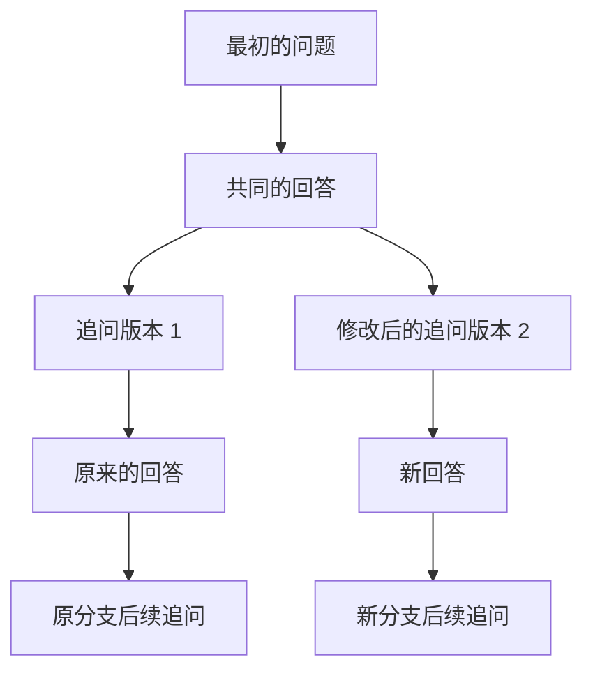

# 编码器模板绘图与对话分支实现方案

状态：两项功能已实施并完成回归、Lint 与测试 APK 构建。此前的图片发送配置拦截修复继续保留。

## 1. 目标与现状

增加按编码原理生成的卷积码编码器、循环码编码器和卷积码状态转移图。模型给出编码参数，本地程序推导结构并套用固定模板，图形适配墨格的白纸与黑板主题。

增加“点击追问气泡 → 修改输入 → 发送新版本”的交互。原输入、原回答以及原来的后续追问全部保留。气泡下方的左右箭头切换完整分支，可以反复修改，形成三个或更多版本。

当前绘图已经使用 `DiagramSpec → DiagramLayout/DiagramRenderer → DiagramImageStore`；图槽位、公式标签、主题变体和图片持久化可以继续使用。当前消息按时间排列，`replyToMessageId` 只关联回答与问题，尚不能表达分支。`GenerationPreparer` 的历史和历史文档也从整个会话读取，接入分支时必须一起修改。

## 2. 编码器：参数驱动的固定模板

### 2.1 第一版覆盖范围

- 二进制、单路输入的前馈卷积码编码器；优先覆盖样图的两路输出、2/3 级记忆，对应 K=3/4。
- 二进制系统循环码的串行反馈编码器，包含信息位和校验位两个工作阶段。
- 从同一份卷积码参数生成四状态和八状态转移图。

编码器模板首版建议支持最多 8 个寄存器、4 路输出；完整状态图首版最多 8 个状态。更大的状态图明确提示超出绘图范围，保留计算结果与文字解释。递归卷积码、多路输入和非系统循环码先不混用这些模板，后续分别增加规格与模板。

仅有 `(2,1,3)` 或 `(7,4)` 不能唯一确定抽头连接，还需要生成多项式。参数不足时提示补充；如果给出一个教学示例，必须明确标注“示例参数”。

### 2.2 卷积码编码器与状态图共用计算核心

规范采用 D⁰ 表示当前输入，D¹、D² 表示延迟一拍、两拍。抽头用指数数组保存，避免二进制字符串与八进制记号的方向歧义。

样图 `(2,1,3)` 对应：

```text
g₁(D) = 1 + D + D²
g₂(D) = 1 + D²
memory = 2，K = memory + 1 = 3，码率 = 1/2
```

状态位约定为“最近的历史输入在前”，即 `s=(s₁,s₂)=(uⱼ₋₁,uⱼ₋₂)`。输入 u 后：

```text
下一状态 = (u,s₁)
输出 c₁ = u XOR s₁ XOR s₂
输出 c₂ = u XOR s₂
```

编码器的寄存器数、抽头、模 2 加法器和输出顺序，以及状态图的每条边，均从这些参数计算。模型不另行提供状态图连线，避免编码器与状态图不一致。

本次已独立核算样图四状态的全部八条转移，核算与 d6 样图均采用参考图的“输出(输入)”格式：

```text
00 → 00：00(0)       00 → 10：11(1)
10 → 01：10(0)       10 → 11：01(1)
01 → 00：11(0)       01 → 10：00(1)
11 → 01：01(0)       11 → 11：10(1)
```

这与样图状态转移关系一致。d6 四状态模板按参考图采用扁菱形的左/上/下/右布局；相反方向的边使用分开的曲线，自环向图外侧展开。圆内显示二进制状态，圆外恢复 a/b/c/d 与 s₀/s₁/s₂/s₃ 编号，全部连线为实线箭头。八状态采用独立的有向环模板和同套教材符号。

### 2.3 循环码采用专门的反馈模板

给定码长 n、信息长度 k、生成多项式 g(x)，令 r=n−k。校验多项式为：

```text
p(x) = [xʳm(x)] mod g(x)
c(x) = xʳm(x) + p(x)       （运算均在 GF(2)）
```

必须检查 `deg(g)=r`、最高项和常数项为 1，以及 `g(x)` 整除 `xⁿ+1`。模板包含 r 个寄存器、由 g(x) 决定的异或抽头、反馈通道与输出选择开关。

固定采用高次信息位先输入，寄存器状态记作 `(sᵣ₋₁,…,s₀)`，gᵢ 为 xⁱ 系数。信息阶段使用：

```text
f = u XOR sᵣ₋₁
s'₀ = f·g₀
s'ᵢ = sᵢ₋₁ XOR f·gᵢ，1 ≤ i < r
```

信息阶段输出原信息位，反馈接通；处理完 k 位后，寄存器保存 p(x)。校验阶段断开反馈、逐拍输出最高位并移位，共输出 r 位。图上的开关、阶段标签和模拟器都遵守同一时序。

验算示例：`(7,4)`、`g(x)=x³+x+1`、信息位 `1001`，得到校验位 `110`、系统码字 `1001110`；码字除以 g(x) 的余数为 0。

本次方案核对也遍历了该 `(7,4)` 示例全部 16 种信息输入，确认上述反馈更新式与多项式除法得到相同校验位。这里只验证了数学约定，尚未实现或验证 Android 绘图模板。

### 2.4 接入现有图形协议

继续使用回答的 `diagrams` 数组及现有 `[[FIGURE:n]]` 编号，新增三个明确的 profile 和一个可选 `coding` 参数对象。示意结构：

```json
{
  "title": "(2,1,3)卷积码编码器",
  "profile": "convolutional_encoder",
  "coding": {
    "version": 1,
    "memory": 2,
    "generators": [[0,1,2],[0,2]],
    "outputMode": "serial"
  }
}
```

循环码参数使用 n、k、generatorExponents；状态图使用与卷积码编码器相同的 memory、generators。图片的节点和坐标由本地推导，模型无需输出 nodes/edges。

具体改动：

1. 在 `domain/coding/` 新增规格校验、GF(2) 多项式运算、卷积码模拟和循环码模拟。
2. 扩展 `DiagramSpec` 和 `DiagramParser`：只有识别到有效 coding profile 时才允许省略通用 nodes/edges；旧图的校验规则保留。
3. 新增 `CodingDiagramRenderer`，由现有绘图入口分派至对应模板；通用通信框图继续使用原布局。
4. 扩展提示词、图规格台账和渲染版本。非法参数形成带原因的失败槽位，后续图片编号保持正确。

模板统一寄存器大小、间距、线宽、箭头和公式字号。寄存器保持水平对齐，抽头按固定通道正交走线；四/八状态图使用曲线箭头。用内容测量保证标签不压线，并生成明暗两套主题样图供检查。

## 3. 对话分支：编辑输入新增版本

### 3.1 用户操作

1. 点击追问气泡的文字/空白区域，底部现有输入栏进入“修改输入”模式，显示关闭按钮。点击图片或文档仍打开预览。
2. 载入该问题的原始输入、图片和文档。编辑不会立即改写历史消息；普通待发送草稿与编辑草稿分开保存。
3. 点击发送后，创建新问题、新回答位置和请求，自动显示新版本。旧版本及其后续对话完整保留。
4. 气泡下方出现 `‹  2 / 2  ›`，右对齐、使用当前主题颜色。只有一个版本时隐藏；边界箭头禁用，不循环跳转。
5. 点击左右箭头时，同时切换该问题的回答和后续追问。再次编辑任一版本，会新增第三个版本，不覆盖已有版本。

文字和附件都未改变时，编辑发送按钮禁用；需要仅更换回答时仍使用“重新生成”。

示意：



共同前缀共享存储；分叉处之后按各自分支保存。不会把旧分支后续追问接到新回答后面。首版入口优先放在追问气泡，底层结构也支持以后修改首问。

### 3.2 持久化结构

推荐使用消息树，不复制整个会话，也不通过覆盖消息正文来保存版本：

- `MessageEntity` 增加 nullable `parentMessageId`，表示这条消息的直接前驱。
- 回答的父消息是对应问题；问题的父消息是上一条回答。原有 `replyToMessageId` 继续供题册、分享和回答归属使用。
- 编辑问题时，新问题与原问题有相同的父消息，它们是同一分叉点的不同版本。
- 新增 `BranchSelectionEntity`，保存各分叉点当前选中的子消息。键为会话 ID 与分叉点 key；根分叉点使用固定 ROOT key，普通分叉点使用父消息 ID。
- 每个分叉点保存选择，因此切回旧版本时可以恢复该子树内上次选择的后续路径。

选中路径由根开始，沿每个分叉点保存的选择向下读取。选择失效时回退到该分叉点第一个有效子消息，并修复记录。写入必须校验父消息属于同一会话、角色顺序有效且不存在环。

数据库从当前 v4 迁移至 v5。旧消息按原有 `created_at,rowid` 顺序回填为一条链；保留所有消息 ID、附件、回答关联和题册快照。分支关系属于永久消息数据，不依赖会定期清理的 request 记录。

### 3.3 生成流程与上下文

`Submission` 增加本次提交的父消息锚点。普通追问锚定当前可见分支末端；编辑旧问题锚定原问题的父消息。点击发送时固定锚点，后续切换页面不能改变它。

`GenerationPreparer` 只读取该锚点的祖先链，并据此生成历史快照。历史文字、题目图片、转写结果和文档都必须使用同一条链；当前读取整会话的文档聚合也要改为分支范围。

新问题、新回答占位、请求和分支选择在同一事务中提交，继续使用管理器现有的单任务锁。提交前的看图配置检查继续生效；被拒绝时保留编辑内容和原分支，不创建空版本。

重试根据对应问题的祖先链取上下文，不根据用户此刻正在浏览的另一分支取历史。每个请求仍按 requestId、attemptId、answerMessageId 固定归属。切换分支不会启动网络请求，也不会把正在生成的回答写入另一个版本。

首版保持同时只生成一个回答。生成期间可以浏览其他版本；创建另一份回答的发送操作暂时禁用，并明确显示“另一个版本正在生成”。

### 3.4 页面状态和周边功能

- `buildSolveItems` 只接收当前选中路径；气泡附带版本序号、总数及可切换版本 ID。
- 编辑状态记录目标问题 ID、固定父锚点、原文和附件。编辑期间先取消或完成编辑再切换版本，避免修改目标与页面版本混淆。
- 取消编辑恢复编辑前的普通草稿。普通草稿按会话与分支末端分槽保存，编辑草稿另存；切换版本时保留各分支草稿。
- 切换版本保留分叉气泡的位置，不因为出现新消息 ID 自动滚到页面底部。各分支分别保存滚动锚点。
- 重试/重新生成入口依据“当前分支最后一个回答”判断，不依据全会话最后的创建时间。
- 分享和保存题册使用当前可见的问题与回答；已经保存的题册快照不因切换版本被改写。
- 历史搜索命中隐藏分支时，打开对应路径。附件清理检查所有分支和草稿的引用，隐藏分支的图片不能被误删。

## 4. 实施顺序与验收

两项功能可以分别实施，不互相等待。

**绘图先完成计算核心，再接入模板和图槽位。** 使用样图 K=3/4 的两种卷积码编码器、四状态图、八状态图及 `(7,4)` 循环码生成样例。验收抽头与公式一致、状态转移完整、码字除余数为 0、串行输出顺序正确、节点不重叠、文字不压线、明暗主题可读。没有生成多项式时不猜电路。

**分支先完成数据迁移和路径读取，再接入编辑栏和左右切换。** 验收旧对话升级不丢记录、编辑中间追问保留两条完整后续路径、三个以上版本与嵌套分叉能恢复、重启后选择与草稿保留、切换分支不发请求、模型历史不包含其他分支的文字/图片/文档、失败与配置不足不丢草稿、连点不产生重复版本、隐藏分支生成正确归属、题册和分享关联不变。

绘图改动集中在参数解析、数学计算与渲染；对话分支涉及数据库、历史快照、生成归属、草稿和页面，因此需要作为独立的一组完整改动验收，不能只增加两个切换按钮。


## 5. 实施记录（2026-10-06）

已完成 `domain/coding/CodingSpec.kt` 的规格校验与编码计算，并由 `CodingDiagramRenderer` 提供三种固定模板。卷积码 K=3/4、四/八状态图、系统循环码 (7,4) 和四路并行输出已用生产绘图入口导出明暗样图。循环码测试独立使用多项式长除法，对全部 4/11 位信息以及 57 位边界样本核对余式。参数缺失或非法保留失败图槽，不改变后续图片编号。

消息父链、分支选择和数据库 v5 迁移已接入。新问题、回答占位、请求与选中版本在同一事务写入；界面以 Room 事务快照读取整棵消息树。旧记录按原创建时间与 rowid 回填，已有字段不修改。父消息删除采用 SET NULL；会话外键仍级联删除，避免长消息链引发 SQLite 递归删除深度限制。

点击追问文字或空白区域进入编辑，原文及附件保留，未修改时发送禁用；取消恢复普通草稿。发送后新增完整分支，气泡下方箭头切换版本并保留阅读位置。普通草稿按分支保存，编辑草稿另存。重试历史、图片和文档均按原问题祖先读取；隐藏分支仍可生成，切换不会发请求。历史搜索打开命中分支；历史批量收藏使用当前分支中最新完整问答。共享附件不会因编辑移除而删除，删除历史会清理各分支草稿。

图形首版范围与参数协议见 [编码图说明](coding-diagrams.md)。远程模型输出参数的正确性仍取决于题意与回答；客户端测试验证数学计算、解析、绘制和持久化流程。测试 APK 使用独立的 `.debug` 应用 ID，本次没有发布正式版。


## 6. 验证结果

- 全量 `testDebugUnitTest` 执行 1089 项：1088 项通过，唯一失败为新增搜索测试仍期待问题 ID；补齐完整回答后，最新命中应为回答 ID。修正该测试断言后，`ConversationBranchesTest` 全部 4 项复测通过。生产代码在这两轮之间未修改。
- `lintDebug` 与 `assembleDebug` 通过。
- v2/v3/v4 旧数据库按生产迁移链升至 v5，旧字段不变；1200 条消息的长对话可以正常删除。
- 编码器六类样例共导出 12 张明暗 PNG；四状态与八状态转移、循环码余式、失败图槽、旧图协议兼容检查通过。
- 编辑中间问题、原后续保留、嵌套选择、分支草稿、编辑重启恢复、提前输入保存、配置拒绝保留草稿、隐藏分支生成和模型上下文隔离检查通过。
- Compose 检查气泡编辑、边界箭头禁用、切换滚动锚点及编辑区主题。按钮位于输入栏上方，图与界面均已视觉检查。

测试包：`release-output/Moge-coding-branches-debug.apk`，独立 debug 应用，0.3.7 / versionCode 17。未安装到用户设备，未发布正式版。

APK SHA-256：`6f16a632ec9f95f446fe6de2c14957d32c7529ec5af8c8865f8d2744687ca515`

## 7. 编码图结构清晰度改进（d5，2026-10-06）

- 卷积码共用上方移位寄存器，各路在下方逐级二输入异或，避免多条抽头挤在一个求和圆上。实心点明确连接，跨线弧明确不连接；公式放在所有走线下方，串行输出使用并串转换模块。
- 循环码画出反馈开关 A 与输出开关 B，默认位置对应信息阶段，并注明两个开关同步切换的规则。最高位返回反馈与系数抽头分配分别位于寄存器上方、下方；信息和校验输出绕线不交叉。
- 状态图使用“输入 / 输出”标注；输入 0 为实线，输入 1 为蓝色虚线。八状态按真实有向环排列，额外连线分配内外弧；标签留在对应边上，圆内直接显示二进制状态。
- 渲染缓存更新到 d5，旧结构化图片按既有升级流程重新生成；画布尺寸向下取整，确保不超过 800 万像素。

本轮相关检查 83 项全部通过，覆盖编码数学核心、图形解析与渲染、缓存版本刷新、模型图槽和请求载荷；`lintDebug` 与 `assembleDebug` 通过。11 组规格导出 22 张明暗 PNG，另覆盖二状态、四输出状态图、单抽头与一级/八级循环码，并检查画布裁切和视觉可读性。没有调用远程模型测试。

测试包：`release-output/Moge-coding-clear-debug.apk`，独立 debug 应用，0.3.7 / versionCode 17，v2 签名校验通过。样图包：`release-output/Moge-coding-clear-samples.zip`。本轮未发布正式版。

APK SHA-256：`abb126a5f32e8033c76528a598df680769966992b86da2f017e5c64742305c14`

## 8. 按用户教材参考图调整（d6，2026-10-06）

已对照附件图 9.5.2、9.5.3、9.5.4。卷积码恢复中间水平寄存器、上下单个多输入加法器、左右与内侧抽头、外侧输出线、右侧开放触点拨杆与旋转箭头；K=3 使用宽矩形，K=4 使用紧凑矩形。四状态恢复扁菱形、a/b/c/d 与 s₀/s₁/s₂/s₃、外围弧线、中心双向弧线、左右自环，以及全部实线和“输出(输入)”标注。循环码开关改为同套教材的开放符号 K₁/K₂；八状态沿用该套符号和标注。

多于两路输出的抽头向加法器外侧分配通道，避免穿过其他输出加法器。各输出走线使用独立通道，避免共用线段造成图上误连。`CodingReferenceTemplateTest` 分别覆盖参考 K=3 的输入端位置、全部支持级数/路数的加法器避让，以及输出通道隔离。

本轮 86 项相关检查全部通过，`lintDebug` 无错误，`assembleDebug` 与 APK v2 签名校验通过。共 12 组规格、24 张明暗 PNG。参考图与结果的并排对照保存为 `docs/coding-samples/reference-comparison.jpg`，旧结构化图片缓存升级至 d6。

测试包：`release-output/Moge-coding-reference-debug.apk`，独立 debug 应用，0.3.7 / versionCode 17。样图包：`release-output/Moge-coding-reference-samples.zip`。未发布正式版。

APK SHA-256：`e93103663351c1d121ec64dd65aa957c1e96a5129d539fe0ae191c9a02b30475`

## 9. 0.3.8 发布前回归（2026-10-06）

版本提升至 0.3.8 / versionCode 18。完整 Android 回归共 1092 项，全部通过，无失败、错误或跳过；Python 发布工具 18 项检查通过。

全量检查中发现解题页测试的 Unconfined 主线程调度会与 IO 恢复并发，偶发覆盖刚添加的输入并造成等待超时。测试改为 StandardTestDispatcher，主动推进主线程任务，并在结束时清理 ViewModelStore；缺图检查走真实的照片回传路径。相关 39 项定向检查及后续完整回归均通过，生产行为未因该测试调度修正而改变。

正式版使用现有标签发布工作流进行完整检查、专用长期签名及资产校验，运行结果见 [发布工作流](https://github.com/fxx255/moge/actions/workflows/tag-release.yml)。此前各节的测试包与样图记录保留原版本及哈希。
